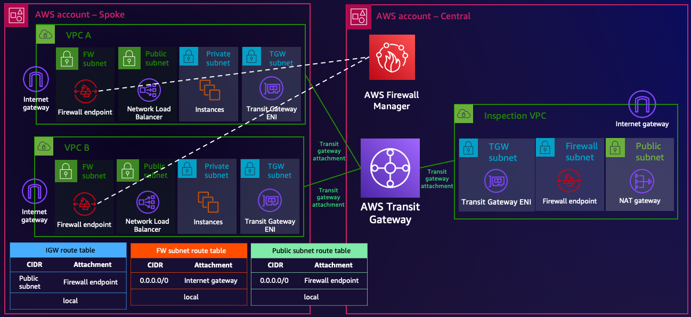

# Manage your AWS Network Firewall resources in multi-Account environments using AWS Firewall Manager - Terraform sample

In this repository, you will use [AWS Firewall Manager](https://aws.amazon.com/firewall-manager/) to deploy decentralized [AWS Network Firewall](https://aws.amazon.com/network-firewall/) resources between AWS Accounts. The purpose of the repository is to show how to create Firewall Manager rules using IaC (Terraform as an example) in a central Networking/Security AWS Account, while all the extra routing configuration needed in the Spoke AWS Accounts (to point the traffic to/from the Internet gateway via the firewall endpoints).

Aside the multi-Account Firewall Manager implementation, the repository also creates the following resources:

* Hub and Spoke architecture (with [AWS Transit Gateway](https://aws.amazon.com/transit-gateway/)) with centralized inspection in the central Networking/Security AWS Account - this Network Firewall resource is not managed by Firewall Manager.
* Two Spoke VPCs in the spoke AWS Account, both of them attached to the Transit Gateway. Each VPC also has a Network Load Balancer pointing to a target group of several EC2 instances (one created in each Availability Zone where you created resources).
* The Transit Gateway created in the central AWS Account is shared with the AWS Organization using [AWS Resource Access Manager](https://aws.amazon.com/ram/).
* [AWS Secrets Manager](https://docs.aws.amazon.com/secretsmanager/latest/userguide/intro.html) secrets to share information between AWS Accounts (Spoke VPC information, Firewall Manager ID, and Transit Gateway ID).

You will find two folders with the code (*central\_account* and *spoke\_account*) to separate the resources and the actions to perform in two different AWS Accounts. Feel free to deploy everything in one Account, although we recommend the use of two to test the multi-Account functionality of AWS Firewall Manager.



## Prerequities

* If you use two AWS Accounts - make sure you use different AWS credentials when initializing the provider in each folder.
* [AWS Organizations](https://docs.aws.amazon.com/organizations/latest/userguide/orgs_introduction.html) and [AWS Config](https://docs.aws.amazon.com/config/latest/developerguide/WhatIsConfig.html) should be enabled in your AWS Account(s) to use Firewall Manager. Check the [documentation](https://docs.aws.amazon.com/waf/latest/developerguide/fms-prereq.html) to understand the prerequisites needed to enable Firewall Manager.
* Terraform installed.

## Code Principles

* Writing DRY (Do No Repeat Yourself) code using a modular design pattern.

## Usage

* Clone the repository.

```
git clone https://github.com/aws-samples/manage-aws-network-firewall-multi-account-aws-firewall-manager.git
```

* Edit the *variables.tf* in each folder to configure your environments:
  * *central\_account*: you can configure the Network supernet, and Inspection VPC information.
  * *spoke\_account*: you can configure the Spoke VPC(s) information.
  * Two variables (*aws\_region* and *secrets\_names*) should be configured with the same values in both folders, to have all the resources working in the AWS Region and to share infrastructure information using Secrets Manager.

## Deployment

Given we are working in a multi-Account environment, we need to deploy the resources in a specific order. The idea is also to show what is the normal deployment flow in a real environment when having centralized Networking and Security services (such as AWS Transit Gateway or AWS Firewall Manager).

**In each step, make sure you use the proper AWS Account (folder).**

### Step 1 [CENTRAL ACCOUNT] - Transit Gateway and Secrets Manager

First, we deploy the Transit Gateway to allow VPC attachments from the Spoke AWS Accounts, and the Secrets Manager secrets. In this first iteration, the Transit Gateway ID is provided so in the next step can be used by the Spoke Account. We are also sharing the Transit Gateway with the AWS Organization using AWS RAM.

```
terraform apply -target="aws_secretsmanager_secret.spoke_vpc_information" -target="aws_secretsmanager_secret_version.transit_gateway" -target="aws_ram_resource_association.tgw_share" -target="aws_ram_principal_association.principal_association"
```

Note that when doing a `terraform plan`, there are more resources to add than the specified as *targets*. To simplify the command, we are taking advantage of the [target](https://developer.hashicorp.com/terraform/tutorials/state/resource-targeting) functionality in Terraform, that also deploys resources that the targets depend on. We are following this pattern in the rest of steps.

### Step 2 [SPOKE ACCOUNT] - Spoke VPCs and Secrets Manager

Once we have the Transit Gateway deployed in the central Account, we can create the Spoke VPCs in the spoke Account. In addition, we add the spoke VPC information (TGW VPC attachment IDs, CIDR blocks to use for the firewall subnets, and VPC IDs) to the Secrets Manager secret provided by the central Account.

```
terraform apply -target="module.ingress_vpcs" -target="aws_secretsmanager_secret_version.spoke_vpc_information"
```

### Step 3 [CENTRAL ACCOUNT] - Hub and Spoke architecture

It's time to configure all the routing logic with the Transit Gateway (hub and spoke with central Inspection VPC). Note that the Inspection VPC is used for east-west and egress traffic. Later we will configure the inspection for ingress traffic with Firewall Manager (decentralized ingress in all the Spoke VPCs).

```
terraform apply -target="module.hubspoke"
```

You may ask yourself: "why not deploy the compute resources in the spoke Account at the same time?". Well, those instances will require some Internet connectivity at creation (packages to create the HTTP server), so we need to provide this connectivity via the central Inspection VPC first.

### Step 4 [SPOKE ACCOUNT] - Compute resources

Once the hub and spoke configuration is ready, and we are providing Internet access via the central Inspection VPC, let's deploy the compute resources (NLBs and EC2 instances).

```
terraform apply -target="module.compute"
```

### Step 5 [CENTRAL ACCOUNT] - AWS Firewall Manager policy

Time to test Firewall Manager! Now we are deploying the Firewall Manager policy, and we add its ID to the corresponding Secrets Manager secret (we need to pass this information to the spoke Account). We don't need to do a target now as we are deploying the last resources needed in the central Account.

```
terraform apply
```

**Before proceding to finalize the deployment in the spoke Account, you need to wait for the provision of the Network Firewall resources managed by Firewall Manager**. The Firewall Manager policy will identify that the Spoke VPCs from the spoke Account are within scope, and it will deploy Network Firewall resources. Before getting the information about those resources to create the VPC routes in the spoke Account, you need to wait for its provision.

### Step 6 [SPOKE ACCOUNT] - VPC routing pointing to the new firewall endpoints.

* First, uncomment line 46 from *main.tf* in the *spoke\_account* folder. This line removes the 0.0.0.0/0 route to the Internet gateway (VPC module configuration).
* Now, let's deploy the VPC routing to force the ingress traffic to be inspected by Network Firewall. We don't need to do a target now as we are deploying the last resources needed in the spoke Account.

```
terraform apply
```

## Firewall policies

### AWS Firewall Manager - Decentralized ingress policy

You can find the Firewall Manager policy definition in the *main\_central\_account.tf* file:

```hcl
resource "aws_fms_policy" "ingress_policy" {
  name          = "ingress-fms-policy"
  description   = "FMS Policy - Ingress VPCs."
  resource_type = "AWS::EC2::VPC"

  remediation_enabled                = true
  delete_all_policy_resources        = true
  delete_unused_fm_managed_resources = true

  exclude_resource_tags = false
  resource_tags = {
    fms_ingress = true
  }

  security_service_policy_data {
    type = "NETWORK_FIREWALL"

    managed_service_data = jsonencode({
      type = "NETWORK_FIREWALL"
      networkFirewallStatelessRuleGroupReferences = [{
        resourceARN = aws_networkfirewall_rule_group.drop_remote.arn
        priority    = 1
      }]
      networkFirewallStatelessDefaultActions         = ["aws:forward_to_sfe"]
      networkFirewallStatelessFragmentDefaultActions = ["aws:forward_to_sfe"]
      networkFirewallStatelessCustomActions          = []
      networkFirewallStatefulEngineOptions           = { ruleOrder = "STRICT_ORDER" }
      networkFirewallStatefulRuleGroupReferences = [{
        resourceARN = aws_networkfirewall_rule_group.allow_ingress.arn
        priority    = 1
      }]
      networkFirewallStatefulDefaultActions = ["aws:drop_strict", "aws:alert_strict"]
      networkFirewallOrchestrationConfig = {
        singleFirewallEndpointPerVPC = false
        allowedIPV4CidrList          = local.fms_ingress_allowedIPV4CidrList
        routeManagementAction        = "MONITOR"
        routeManagementTargetTypes   = ["InternetGateway"]
      }
    })
  }
}
```

You can check the [AWS documentation](https://docs.aws.amazon.com/waf/latest/developerguide/network-firewall-policies.html) and [Terraform Registry resource](https://registry.terraform.io/providers/hashicorp/aws/latest/docs/resources/fms_policy) to get more information about the format and content of this resource. Regarding the firewall policy itself:

* The stateless rule group blocks any SSH traffic. You can see this rule group defined in the *central\_account/firewall\_policy.tf* file. Traffic not blocked will be sent to the stateful engine.
* The stateful rule group (STRICT) blocks any traffic by default, and it only has one pass rule allowing HTTP traffic from the Internet to any resource inside the VPC.

```
pass tcp $EXTERNAL_NET any -> $HOME_NET any (msg: "Allowing HTTP ingress access"; sid:2; rev:1;)
```

### AWS Network Firewall - Centralized policy

You can find the Firewall Manager policy definition in the *firewall\_policy.tf* file:

```hcl
resource "aws_networkfirewall_firewall_policy" "central_inspection_policy" {
  provider = aws.awscentral

  name = "central-firewall-policy-${var.identifier}"

  firewall_policy {
    # Stateless configuration
    stateless_default_actions          = ["aws:forward_to_sfe"]
    stateless_fragment_default_actions = ["aws:forward_to_sfe"]

    stateless_rule_group_reference {
      priority     = 10
      resource_arn = aws_networkfirewall_rule_group.drop_remote.arn
    }

    # Stateful configuration
    stateful_engine_options {
      rule_order = "DEFAULT_ACTION_ORDER"
    }
    stateful_rule_group_reference {
      resource_arn = aws_networkfirewall_rule_group.drop_east_west.arn
    }
  }
}
```

You can check the [AWS documentation](https://docs.aws.amazon.com/network-firewall/latest/developerguide/what-is-aws-network-firewall.html) and [Terraform Registry resource](https://registry.terraform.io/providers/hashicorp/aws/latest/docs/resources/networkfirewall_firewall_policy) to get more information about the format and content of this resource. Regarding the firewall policy itself:

* The stateless rule group blocks any SSH traffic. You can see this rule group defined in the *central\_account/firewall\_policy.tf* file. Traffic not blocked will be sent to the stateful engine.
* The stateful rule group (DEFAULT) blocks any ICMP or TCP traffic from VPCs in the network (supernet defined in the $NETWORK variable).

```
drop icmp $NETWORK any -> $NETWORK any (msg: "Blocking East-West traffic"; sid:1; rev:1;)
drop tcp $NETWORK any -> $NETWORK any (msg: "Blocking East-West traffic"; sid:2; rev:1;)
```

## Cleanup

Same as with the deployment, we need to destroy the resources in a certain order.

* STEP 1 [SPOKE ACCOUNT] - Delete VPC routes pointing to the firewall endpoint. That way Firewall Manager can remove the Network Firewall resources once we remove the policy in the central Account.
  * In addition, comment back line 46 - so when you deploy everything again, that VPC route is created.

```
terraform destroy -target="module.vpc_resources" -target="module.vpc_routes"
```

* STEP 2 [CENTRAL ACCOUNT] - Delete Firewall Manager policy. **Wait for the Network Firewall resources, firewall subnets and route tables to be deleted from spoke Account**

```
terraform destroy -target="aws_fms_policy.ingress_policy"
```

* STEP 3 [SPOKE ACCOUNT] - Delete Spoke VPCs and compute resources (last resources in spoke Account)

```
terraform destroy -target="module.ingress_vpcs" -target="module.compute"
```

* STEP 4 [CENTRAL ACCOUNT] - Delete all the resources left in the central Account

```
terraform destroy
```

## Security

See [CONTRIBUTING](CONTRIBUTING.md#security-issue-notifications) for more information.

## License

This library is licensed under the MIT-0 License. See the LICENSE file.
